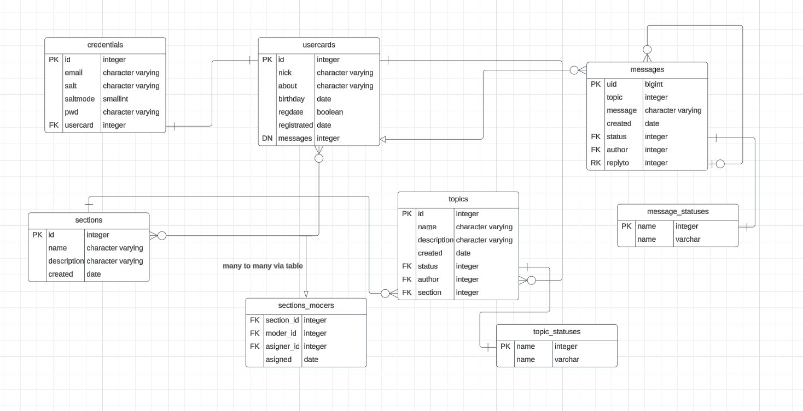

# Kchan forum
casual forum for MSU students I develooped for my Java prac.

---
based on this ERD

SQL script for creation and filling is [here](db_scheme.sql)

_in russian:_
Common scenarios, entity usages and page structure [here](scenarios.md)