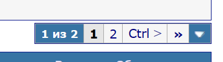
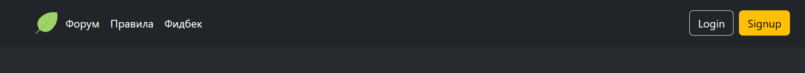
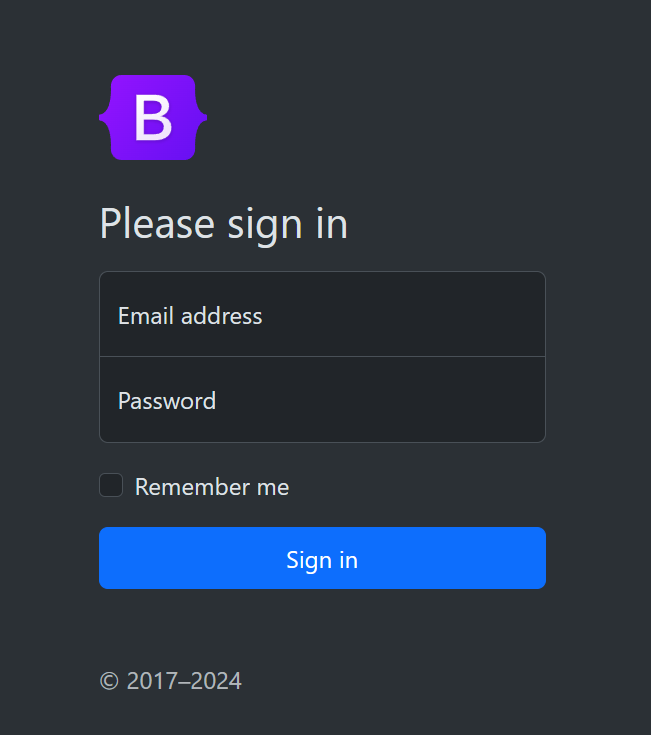
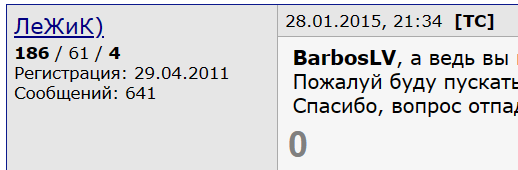

# Сценарии переходов по старницам
Везде где используются списки подразумевается
т.н. пагинация(пейджинг) - разбиение большого
списка на несколько страничек, так что отображается
только 1 страничка, но можно запросить любую страничку
из разбиения

## Шапка
Не страничка, но позволяет переходить
к Форуму(Главная), к правилам, к обратной связи
и к аутентфикации/профилю

## Страничка правил
Прочитать правила и по шапке перейти
на другие страницы

## Страничка Обратная связь
Заполнить простенькую форму обратной связи,
нажать отправить и попасть на Форум(Главная)

## Страничка аутентификации
Пройти авторизацию/регистрацию,
при неверных данных(неверный пароль,
никнейм уже занят, не заполнены обязательные поля)
появляется соответствующее сообщение об
ошибке в виде чего-нибудь красненького,
при успешной авторизации/регистрации
пользователь перенаправляется на Форум

## Страничка Профиля
содержит карточку пользователя
Если пользователь смотрит свою карточку,
то все атрибуты доступные для изменения
представлены input'ами и снизу есть
кнопка сохранить, после которой
появляется что-нибудь зелененькое,
уведомляющее об успешном изменении.
Также есть кнопка выйти
Если пользователь смотрит чужую карточку,
то поля менять нельзя, но если этот
пользователь админ, то у него есть 
кнопка забанить, иначе кнопка пожаловаться
которая ведет на форму обратной связи.

_Карточка пользователя содержит_ 
- никнейм
- обо мне
- др(опционально)
- дата регистрации
- количество сообщений

Карточка пользователя содержит атрибуты
сущности Usercard

## страничка Форум(Главная)
содержит т.н. 
[Breadcrumb](https://getbootstrap.com/docs/5.3/components/breadcrumb/)
`/форум[/<section>[/<topic>]]`
по которому можно возвращаться

### на Главной странице
Содержится именное приветствие,
если пользователь авторизован.
И приветствие для новичков(или описание форума),
если пользователь не авторизован.
Содержится список разделов, возможно какие-то
еще сообщения от администрации. 
Из списка разделов можно провалиться в выбраный раздел

_каждый раздел в списке содержит_
- название
- описание сокр.
- дата создания

### на страничке Раздела
Содержится информация о разделе(имя, описание, модеры, ...)
У админа есть возможность редактировать информацию
о разделе(input'ы и кнопка сохранить),
а также кнопка "активные пользователи раздела", которая 
переводит его на страничку активных пользователей раздела.
Еще у админа будет кнопка "модеры раздела", которая
переводит его на страничку модеров раздела
Содержится список тем этого раздела
Из списка тем можно провалиться в выбраную тему.

_раздел на страничке раздела содержит_
- название
- полное описание
- дата создания

_тема в списке тем содержит_
- название
- описаник сокр
- автор
- дата создания
- статус

#### страничка активных пользователей раздела
Содержит список пользователей писавших что-то
в разделе отсортированный по убыванию их сообщений
в этом разделе, а также рядом с каждым пользователем
будет кнопка назначить модером раздела(или разжаловать
если пользователь уже модер)

#### страничка модеров раздела
Содержит список модеров данного раздела, рядом есть
кнопка "разжаловать"

### на страничке Темы
Содержится информация о теме(заголовок, описание, автор,..)
У автора|модера|админа есть возможность изменить
(input'ы + сохранить), у иных есть кнопка "пожаловаться",
ведущая на форму обратной связи.
Есть кнопка написать сообщение, которое переносит
пользователя к концу списка сообщений
Есть список сообщений.
В конце списка сообщений есть редактор сообщений
у которого есть кнопка отправить, посылающее сообщение
У модера или админа есть кнопка удалить сообщение,
у иных есть кнопка "пожаловаться" на сообщение,
ведущая на форму обратной связи

_тема на своей страничке содержит_
- название
- полное описание
- дата создания
- статус
- автора

#### блок сообщение
| имя автор       | дата      | ид сообщения   |
|-----------------|-----------|----------------|
| карточка автора | сообщение |                |
| ответить        | жалоба    | (модер)удалить |

_примерно как тут:_ 

---

# Сценарии по отношению к сущностям

### аутентификация(credentials)
- регистрация/авторизация

### карточка профиля
- изменить некоторые данные о себе
- посмотреть открытые данные о пользователе
- (админ) блокировать пользователя

### главная страничка
- выбрать раздел
- получить информацию от администрации

### раздел форума
- (админ)создать раздел(с главной странички)
- посмотреть список тем
- (админ)руд
- (админ)назначить модера на раздел

### тема
- создавть тему(со странички раздела)
- показать сообщения с пагинацией
- написать сообщение
- написать ответ
- (модер) удалить сообщение
- (модер) удалить/изменить тему
// изменить тему например, поставить плашку
// что обсуждение переехало в другую тему
- (админ) перекинуть тему в другой раздел

---

